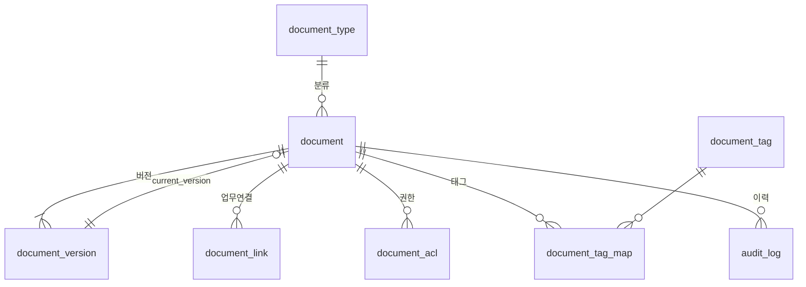

# DMS 설계안 — 문서·정보 통합 관리

> 대상 스택: NestJS + PostgreSQL (일부 BaaS 병행)
> 범위: 메타데이터 통합 인덱스 / 버전·이력 관리 / 권한·감사 로그
> 작성일: 2026-08-18

---

## 0. 결론 먼저

**가능합니다.** 다만 현재 구조("PDF는 드라이브, 나머지는 DB")를 그대로 두고 DMS를 얹으면 반드시 깨집니다.
바꿔야 할 전제는 하나입니다.

> **드라이브를 "문서 저장소"가 아니라 "바이트 저장소(blob store)"로 격하시키고,
> DB의 `document` 테이블을 문서의 단일 진실 원천(SSOT)으로 삼는다.**

지금은 "드라이브에 파일이 있다"가 문서의 존재 증명입니다. DMS에서는 **"DB에 레코드가 있다"가 존재 증명**이고,
드라이브 파일 ID는 그 레코드가 들고 있는 여러 속성 중 하나일 뿐입니다.
이 전환 하나만 하면 버전·권한·감사·검색이 전부 DB 안에서 해결됩니다.

### 왜 드라이브를 SSOT로 쓰면 안 되는가 (조사 근거)

| 문제 | 실제 제약 |
|---|---|
| 버전이 조용히 사라짐 | 바이너리(PDF 등) 리비전은 `keepForever` 미지정 시 **30일 후 자동 삭제**, 리비전 100개 초과 시 조기 삭제 |
| 영구보존도 상한 있음 | `keepForever` 지정 가능 리비전은 **최대 200개** |
| 권한을 드라이브에 위임 불가 | Drive 권한 모델(reader/writer/…)은 업무 권한(부서·직급·문서종류별)과 매핑 불가 |
| 감사 추적 불가 | 앱을 거치지 않은 직접 열람은 앱 감사 로그에 남지 않음 |
| 서비스 계정 저장 용량 | 서비스 계정 자체 저장 쿼터가 없어 개인 드라이브 업로드 시 `storageQuotaExceeded` 발생 → **공유 드라이브(Shared Drive) 필수** |
| 처리량 한도 | 일 업로드 750GB, 분당 325,000 쿼터 유닛 |

→ **버전 관리를 Drive revisions에 맡기지 마십시오.** 아래 설계는 버전마다 별도 파일을 만들고 DB가 계보를 관리합니다.

---

## 1. 아키텍처

```
┌─────────────────────────────────────────────────────┐
│  업무 모듈 (계약, 견적, 프로젝트, 결재 …)              │
│    └ 문서가 필요하면 DMS 모듈만 호출. 드라이브 직접 접근 금지 │
└────────────────────────┬────────────────────────────┘
                         │  DocumentFacade
┌────────────────────────▼────────────────────────────┐
│  DMS 모듈 (NestJS)                                   │
│  ┌──────────────┬──────────────┬──────────────┐     │
│  │DocumentSvc   │ AclService   │ AuditService │     │
│  │VersionSvc    │ LinkService  │ RetentionSvc │     │
│  └──────┬───────┴──────────────┴──────────────┘     │
│         │ StorageProvider (인터페이스)               │
│    ┌────┴─────┬───────────────┬─────────────┐       │
│    │GoogleDrive│ Supabase      │ S3/로컬     │       │
│    │Provider   │ StorageProvider│ (향후)      │       │
│    └───────────┴───────────────┴─────────────┘       │
└─────────────────────────────────────────────────────┘
         │                              │
   ┌─────▼─────┐                 ┌──────▼──────┐
   │PostgreSQL │                 │ 공유 드라이브 │
   │(메타/권한/ │                 │ (바이트만)   │
   │ 감사/버전) │                 └─────────────┘
   └───────────┘
```

### 핵심 원칙 4가지

1. **업무 모듈은 드라이브를 모른다.** `documentId`만 알면 된다.
2. **드라이브 링크를 화면에 절대 노출하지 않는다.** 모든 열람/다운로드는 앱 프록시 엔드포인트를 통과한다 → 여기서 권한 검사와 감사 로그가 동시에 찍힌다.
3. **저장소는 교체 가능해야 한다.** `StorageProvider` 인터페이스 하나만 두면 Drive → Supabase Storage → S3 이전이 마이그레이션 스크립트 하나로 끝난다. (BaaS를 병행 중이라면 특히 중요)
4. **파일은 불변(immutable)이다.** 수정 = 새 버전 파일 생성. 덮어쓰기 금지.

### StorageProvider 인터페이스 (최소 계약)

```ts
interface StorageProvider {
  readonly kind: 'gdrive' | 'supabase' | 's3';
  put(input: { buffer|stream, mimeType, path, fileName }): Promise<{ storageKey, bytes, checksum }>;
  getStream(storageKey: string): Promise<Readable>;
  getTempUrl(storageKey: string, ttlSec: number): Promise<string>;  // 대용량 전용
  delete(storageKey: string): Promise<void>;
  copy(storageKey: string, toPath: string): Promise<{ storageKey }>;
}
```

- 일반 파일: `getStream()` → 앱이 프록시 스트리밍 (권한·감사 확실)
- 100MB 이상 대용량: `getTempUrl()` 로 단시간 서명 URL 발급 (감사 로그는 발급 시점에 기록)

---

## 2. 데이터 모델

### ERD



### 2.1 `document_type` — 문서 분류 마스터

| 컬럼 | 타입 | 설명 |
|---|---|---|
| id | smallserial | PK |
| code | varchar(40) UQ | `CONTRACT`, `QUOTE`, `DRAWING`, `REPORT` … |
| name | varchar(100) | 표시명 |
| retention_months | int | 보존기간(만료 시 자동 아카이브) |
| require_approval | bool | 등록 시 승인 필요 여부 |
| allowed_mime | text[] | 허용 MIME |
| storage_kind | varchar(20) | 이 타입의 기본 저장소 |

> 이 테이블이 있어야 "계약서는 5년 보존, 견적서는 1년" 같은 정책을 코드가 아닌 데이터로 관리할 수 있습니다.

### 2.2 `document` — 논리 문서 (SSOT)

| 컬럼 | 타입 | 설명 |
|---|---|---|
| id | uuid PK | 시스템 전역 문서 식별자 |
| doc_no | varchar(40) UQ | 사람이 읽는 문서번호 `CT-2026-0001` |
| type_id | smallint FK | 분류 |
| title | varchar(300) | |
| description | text | |
| status | varchar(20) | `draft` / `active` / `archived` / `deleted` |
| current_version_id | uuid FK | 최신 버전 포인터 |
| owner_id | uuid | 문서 책임자 |
| dept_id | uuid | 소속 조직 |
| meta | jsonb | 타입별 가변 속성 (계약금액, 만료일, 도면번호 …) |
| retention_until | date | 보존 만료일 (type의 retention_months로 산출) |
| created_at / updated_at / deleted_at | timestamptz | 소프트 삭제 |

**인덱스**
```sql
CREATE INDEX ON document (type_id, status, created_at DESC);
CREATE INDEX ON document USING gin (meta jsonb_path_ops);
CREATE INDEX ON document USING gin (to_tsvector('simple', title || ' ' || coalesce(description,'')));
```

> `meta jsonb` 가 이 설계의 유연성 핵심입니다. 문서 타입이 늘어나도 스키마 마이그레이션 없이 확장됩니다.
> 단, **검색·정렬에 자주 쓰는 키는 반드시 생성 컬럼으로 승격**하세요. (예: `expire_date date GENERATED ALWAYS AS ((meta->>'expireDate')::date) STORED`)

### 2.3 `document_version` — 실제 파일

| 컬럼 | 타입 | 설명 |
|---|---|---|
| id | uuid PK | |
| document_id | uuid FK | |
| version_no | int | 1, 2, 3 … (document_id와 UNIQUE) |
| storage_kind | varchar(20) | `gdrive` / `supabase` / `s3` |
| storage_key | text | 드라이브 fileId 또는 버킷 경로 |
| file_name | varchar(300) | 원본 파일명 |
| mime_type | varchar(120) | |
| byte_size | bigint | |
| checksum_sha256 | char(64) | **중복 업로드 탐지 + 무결성 검증** |
| page_count | int | PDF 페이지 수 (선택) |
| change_note | text | "3조 단가 수정" |
| uploaded_by | uuid | |
| created_at | timestamptz | |

**규칙**
- 버전은 **append-only**. 절대 UPDATE 하지 않습니다.
- 새 버전 커밋 = `document_version` INSERT + `document.current_version_id` UPDATE (한 트랜잭션).
- Drive에는 버전마다 별도 파일로 올립니다 → Drive의 30일 리비전 삭제 정책에 영향받지 않음.
- `checksum_sha256` 이 직전 버전과 같으면 업로드 거부(불필요한 버전 증식 방지).

### 2.4 `document_link` — 업무 데이터와의 결합 ★ 이 설계의 핵심

| 컬럼 | 타입 | 설명 |
|---|---|---|
| id | bigserial PK | |
| document_id | uuid FK | |
| entity_type | varchar(50) | `contract` / `project` / `order` / `customer` … |
| entity_id | uuid | 해당 업무 레코드 PK |
| relation | varchar(40) | `attachment` / `signed_copy` / `evidence` / `reference` |
| sort_order | int | |
| created_by, created_at | | |

```sql
UNIQUE (document_id, entity_type, entity_id, relation);
CREATE INDEX ON document_link (entity_type, entity_id);
```

**이 테이블 하나가 "시스템에서 발생하는 문서와 정보를 묶어서 관리"의 답입니다.**

- 업무 테이블마다 `pdf_url` 컬럼을 만들 필요가 없어집니다.
- 한 문서를 여러 업무에 동시에 붙일 수 있습니다 (계약서 1건 → 계약·프로젝트·고객 3곳에서 조회).
- 반대로 "이 프로젝트 관련 문서 전부" 조회가 인덱스 한 방입니다.
- **주의:** 다형성 FK라 DB 레벨 참조 무결성이 없습니다. 업무 레코드 삭제 시 링크 정리를 애플리케이션 레이어(또는 각 엔티티 도메인 이벤트)에서 반드시 처리하세요.

### 2.5 `document_acl` — 문서별 권한 오버레이

| 컬럼 | 타입 | 설명 |
|---|---|---|
| id | bigserial PK | |
| document_id | uuid FK | |
| principal_type | varchar(20) | `user` / `role` / `dept` |
| principal_id | uuid | |
| permission | varchar(20) | `view` / `download` / `edit` / `manage` |
| granted_by, granted_at, expires_at | | 한시적 권한 지원 |

**권한 판정 순서 (AclService)**
```
1. 시스템 관리자        → 전체 허용
2. document.owner_id     → manage
3. document_acl 명시 부여 (expires_at 유효) → 해당 권한
4. document_type 기본 RBAC (역할별 기본 권한 매트릭스) → 해당 권한
5. 그 외                → 거부 (기본 거부 원칙)
```

> 권한 판정 결과는 요청 스코프 내에서 캐싱하세요. 목록 100건 조회에 ACL 쿼리 100번 나가면 안 됩니다.
> `document_link` 로 목록을 뽑을 때는 ACL을 **쿼리 조건에 밀어넣어** 필터링하는 편이 낫습니다.

### 2.6 `audit_log` — 감사 추적

| 컬럼 | 타입 | 설명 |
|---|---|---|
| id | bigserial PK | |
| document_id | uuid | (nullable — 문서 무관 이벤트도 수용) |
| version_id | uuid | |
| action | varchar(30) | 아래 표 참조 |
| actor_id | uuid | |
| actor_ip | inet | |
| user_agent | text | |
| detail | jsonb | 변경 전/후, 실패 사유 등 |
| created_at | timestamptz | |

| action | 기록 시점 |
|---|---|
| `CREATE` | 문서 최초 등록 |
| `VERSION_ADD` | 새 버전 업로드 |
| `VIEW` | 미리보기 열람 |
| `DOWNLOAD` | 파일 다운로드 (서명 URL 발급 포함) |
| `META_UPDATE` | 제목/분류/meta 변경 |
| `LINK_ADD` / `LINK_REMOVE` | 업무 연결 변경 |
| `ACL_GRANT` / `ACL_REVOKE` | 권한 변경 |
| `ARCHIVE` / `RESTORE` / `DELETE` | 상태 변경 |
| `ACCESS_DENIED` | **권한 거부 (보안상 반드시 기록)** |

**운영 팁**
- `created_at` 기준 월별 파티셔닝 (`PARTITION BY RANGE`). 감사 로그는 가장 빨리 커지는 테이블입니다.
- `VIEW`/`DOWNLOAD`는 요청 경로에서 동기 INSERT하면 병목이 됩니다 → 큐/배치 flush 권장.
- 감사 로그는 **UPDATE/DELETE 금지**. DB 권한으로 강제하세요.

---

## 3. 문서 분류 체계 (대·중·소)

### 3.0 설계 원칙 3가지

**① 대분류는 새로 만들지 않는다 — 기존 "업무 영역"을 그대로 쓴다.**
좌측 네비게이션이 이미 `입출고 / 현장 관리 / 자산 / 임직원` 4개 영역으로 나뉘어 있고 사용자가 이를 학습한 상태입니다.
문서 전용 분류축을 별도로 만들면 "이 문서 어디서 찾지?"가 반드시 발생합니다.

**② 분류축과 메타데이터를 섞지 않는다.**

| 구분 | 내용 | 저장 위치 |
|---|---|---|
| **분류** | 문서의 *성격* (변하지 않음, 100~200개 수준에서 고정) | `document_type.code` |
| **메타데이터** | 문서의 *소속* (프로젝트/차수, 거래처, 문서일자, 금액) | `document.meta` + `document_link` |

현장명·차수·거래처를 트리에 넣으면 현장이 늘 때마다 분류체계가 증식하고,
"A현장 3차수 계근표"와 "B현장 1차수 계근표"가 다른 노드가 되어 통합 조회가 불가능해집니다.
검색은 **`분류 + 메타데이터` 조합**으로 풉니다.

**③ 소분류는 실제 서식(양식)과 1:1로 맞춘다.**
"기타 증빙" 같은 추상 노드는 결국 아무도 쓰지 않습니다. 현장에서 실제로 굴러다니는 종이/엑셀 이름 그대로 소분류가 되어야 합니다.

---

### 3.1 분류 트리

| 대분류 (=업무영역) | 중분류 | 소분류 예시 |
|---|---|---|
| **입출고** | 입고 증빙 | 계근표(입고), 매입 거래명세서, 인수증 |
| | 출고 증빙 | 계근표(출고), 출고전표, 매출 거래명세서 |
| | 폐기물 | 폐기물 입고전표, 반출확인서, 올바로 인계서 |
| | 집계·보고 | 자동집계 결과표, 재고실사표, 재고평가 명세, 손익보고서, 출고보고서 |
| **현장 관리** | 프로젝트(차수) | 현장개설 승인서, 매입계약서, 단가합의서, 차수종료 정산서 |
| | 폐기물·올바로 | 배출자 신고필증, 처리업체 계약서, 올바로 실적보고 |
| | 알림·이력 | 이상알림 처리내역, 예외처리 보고서 |
| **자산** | 차량 | 차량등록증, 보험증권, 정비이력, 유류 정산서 |
| | 장비 | 장비 사양서, 임대차계약서, 안전검사 필증 |
| **임직원** | 채용·계약 | 근로계약서, 신분증 사본, 통장 사본 |
| | 근태·공수 | 공수체크표, 출역일보, 임금대장 |
| | 안전·자격 | 안전교육 이수증, 자격증, 건강진단 결과 |

> **시스템 관리** 영역은 문서 대상이 아니라 **분류 자체를 관리하는 화면**입니다.
> `시스템 관리 > 마스터 관리 > 공통코드` 하위에 문서분류 마스터를 붙입니다.

---

### 3.2 분류 코드 체계

```
DOC-{영역2자리}-{중2자리}-{소3자리}

예) DOC-01-01-001   입출고 > 입고 증빙 > 계근표(입고)
    DOC-01-04-005   입출고 > 집계·보고 > 손익보고서
    DOC-02-01-002   현장 관리 > 프로젝트(차수) > 매입계약서
    DOC-04-02-003   임직원 > 근태·공수 > 임금대장
```

- 공통코드 마스터에 **3레벨 self-reference 테이블 1개**로 관리 → 시스템 관리 화면에 자연스럽게 편입됩니다.
- 고정 3단(가변 depth 아님)을 권장합니다. 1인 개발 기준 유지보수 부담이 훨씬 적고,
  깊이가 더 필요한 영역은 **태그 다중부여**(`document_tag`)로 흡수하는 편이 낫습니다.

---

### 3.3 소분류 필수 속성 (`document_type` 확장)

소분류 노드마다 아래 속성을 **처음부터** 채우십시오. 소급 입력이 가장 고통스러운 항목들입니다.

| 속성 | 컬럼 | 왜 필요한가 |
|---|---|---|
| 법정 보존연한 | `retention_months` | 세금계산서 5년, 근로계약서 3년, 폐기물 인계서 3년 등 상이 |
| 원본(실물) 보관 의무 | `require_physical_copy bool` | 스캔본으로 갈음 가능한지 vs 실물 필수인지 |
| 열람 등급 | `default_acl_level` | 단가·손익 문서는 전 직원 공개 불가 |
| 문서 출처 | `origin` | `SYSTEM`(시스템 생성) / `UPLOAD`(외부 유입) — 3.4 참조 |

---

### 3.4 `보고서 보관함`과의 관계 ★ 지금 결정해야 할 사항

이미 `보고 / 평가 / 집계 > 보고서 보관함` 메뉴가 존재합니다. 문서관리를 별도로 만들면 저장소가 둘이 됩니다.
성격은 다음과 같이 다릅니다.

| | 보고서 보관함 | 문서관리 |
|---|---|---|
| 생성 주체 | 시스템이 *생성*한 산출물 | 외부에서 *유입*된 원본 |
| 예시 | 자동집계 결과, 손익보고서 PDF 스냅샷 | 계약서, 계근표 스캔, 필증 |

**권장: 물리 테이블은 `document` 하나로 통합하고, `origin` 구분값으로만 나눈 뒤 화면을 둘로 보여줍니다.**
테이블을 둘로 나누면 통합 검색이 영원히 불가능해집니다.

---

### 3.5 계근표·세금계산서 예외 처리 ★ 반드시 지킬 것

`입고 현황` / `출고 현황`이 이미 트랜잭션 화면으로 존재합니다.
계근표는 건당 수천 장 발생하므로 **문서관리 목록에 올리지 마십시오.**

- 계근표 스캔본은 해당 거래 row의 **첨부파일**로 취급합니다.
  → `document_link (entity_type='weighin', entity_id=계근ID, relation='evidence')`
- 문서관리 목록 화면에서는 **기본 제외 필터**를 걸어둡니다 (필요 시 명시적으로 켜서 조회).
- 동일 논리로 **세금계산서는 ecount 전표에 연결**되어야지, 독립 문서로 관리하면 이중관리가 됩니다.

> 결과적으로 문서관리 모듈이 실질적으로 담당하는 영역은
> **현장 관리 / 자산 / 임직원 / 입출고의 집계·보고** 이며,
> 입출고의 증빙류는 "첨부파일 정책"만 정의하면 됩니다.

---

### 3.6 분류축과 별개로 필수인 메타데이터 3종

분류 트리에 넣지 말고 **컬럼(또는 `meta` 생성 컬럼)으로** 두십시오.

| 항목 | 근거 |
|---|---|
| 프로젝트(차수) ID | 손익 집계 단위. `document_link(entity_type='project')` 로도 동시 표현 |
| 거래처 ID | 시스템 관리에 **거래처 마스터**가 이미 존재 → FK 연결 |
| 문서일자 | 회계기간·보존연한 산출 기준일 (업로드일과 반드시 구분) |

---

## 4. 드라이브 폴더 전략

```
[공유 드라이브] CROSSWB-DMS
 └ 2026/
    └ CONTRACT/
       └ {document_id}/
          ├ v1__계약서_원본.pdf
          └ v2__계약서_수정.pdf
```

- **사람이 보는 폴더 구조를 드라이브에 만들려 하지 마십시오.** 폴더 트리는 앱 화면에서 DB 쿼리로 그립니다.
  드라이브 경로는 장애 시 사람이 파일을 찾기 위한 최소한의 단서일 뿐입니다.
- 반드시 **공유 드라이브**를 사용하세요 (서비스 계정은 자체 저장 쿼터가 없어 개인 드라이브 업로드가 실패합니다).
- 드라이브 파일 권한은 **서비스 계정 단독 소유**. 일반 사용자에게 드라이브 권한을 주는 순간 감사 추적이 무너집니다.
- 한 폴더당 파일 수가 과도해지지 않도록 `연도/타입/문서ID` 3단 분할을 유지하세요.

---

## 5. API 설계 (REST 기준)

| Method | Path | 설명 |
|---|---|---|
| POST | `/dms/documents` | 문서 생성 (메타 + 1차 파일 동시) |
| GET | `/dms/documents/:id` | 상세 (현재 버전 + 링크 + 권한 요약) |
| PATCH | `/dms/documents/:id` | 메타 수정 |
| POST | `/dms/documents/:id/versions` | 새 버전 업로드 |
| GET | `/dms/documents/:id/versions` | 버전 목록 |
| GET | `/dms/documents/:id/content` | **열람/다운로드 프록시** (권한검사+감사) |
| GET | `/dms/documents/:id/versions/:vno/content` | 특정 버전 다운로드 |
| POST | `/dms/documents/:id/links` | 업무 엔티티 연결 |
| DELETE | `/dms/documents/:id/links/:linkId` | 연결 해제 |
| GET | `/dms/entities/:type/:id/documents` | **업무 화면에서 쓰는 핵심 API** |
| POST | `/dms/documents/:id/acl` | 권한 부여 |
| GET | `/dms/documents/:id/audit` | 문서 이력 조회 |
| GET | `/dms/documents?type=&status=&q=&meta.xxx=` | 통합 검색 |
| POST | `/dms/documents/:id/archive` | 아카이브 |

**업로드 방식**: 클라이언트 → 앱 서버 → StorageProvider (프록시 업로드).
직접 업로드(presigned)는 감사·검증·checksum 계산을 우회하므로 대용량 예외 케이스에만 허용하고,
이 경우 완료 콜백에서 반드시 서버가 checksum·크기를 검증한 뒤 버전을 커밋하세요.

---

## 6. 트랜잭션 경계 (가장 자주 깨지는 지점)

파일 저장(외부)과 DB 커밋(내부)은 하나의 트랜잭션이 될 수 없습니다. 순서를 고정하세요.

```
1. DB: document_version INSERT (status='uploading')     ← 먼저 예약
2. Storage: 파일 업로드 → storage_key 획득
3. DB: storage_key/checksum UPDATE + status='ready'
      + document.current_version_id UPDATE   (한 트랜잭션)
4. 실패 시: status='uploading' 인 고아 레코드를 배치가 정리
             (업로드된 파일도 storage_key 있으면 함께 삭제)
```

- **절대 하지 말 것**: 파일 먼저 올리고 DB 실패 → 드라이브에 추적 불가능한 고아 파일이 쌓입니다.
- 매일 1회 **정합성 배치**: `status='uploading' AND created_at < now()-1h` 정리 + Drive 파일 존재 여부 대조.

---

## 7. 도입 단계 (1인 개발 기준 현실적 순서)

| 단계 | 작업 | 기존 시스템 영향 |
|---|---|---|
| **1** | `document`, `document_version`, `document_link` 3개 테이블 + DocumentService + StorageProvider(Drive) 구현 | 없음 (신규 모듈) |
| **2** | 기존 업무 테이블의 `*_file_url` / `drive_file_id` 컬럼을 스캔해 `document` + `document_link` 로 마이그레이션. 기존 컬럼은 남겨둔 채 **이중 기록** | 무중단 |
| **3** | 화면의 파일 링크를 전부 `/dms/documents/:id/content` 프록시로 교체 | 링크 교체만 |
| **4** | `document_acl` + AclService + `audit_log` 투입. 이때부터 권한·이력이 실제로 동작 | 권한 정책 정의 필요 |
| **5** | 기존 파일 컬럼 제거, `document_type` 보존정책·아카이브 배치 가동 | 정리 단계 |

**2단계에서 이중 기록을 반드시 거치세요.** 한 번에 잘라내면 롤백할 방법이 없습니다.

---

## 8. 나중에 추가할 것 (지금은 만들지 마세요)

- **전문 검색(본문 검색)**: PDF 텍스트 추출 → `document_content` 테이블 + `tsvector`. 지금 범위 밖이지만 `document_version.id` 를 FK로 잡을 자리만 비워두면 나중에 무손상 추가됩니다.
- 결재/승인 워크플로우 (`document.status` 에 `pending_approval` 추가 지점)
- 전자서명 연동 (`relation='signed_copy'` 로 이미 수용 가능)
- 썸네일/미리보기 캐시
- 문서 간 관계 (`document_relation`: 원본↔부속, 계약↔변경계약)

---

## 9. 요약 체크리스트

- [ ] 드라이브를 blob store로 격하, `document` 테이블이 SSOT
- [ ] Drive revisions 사용 금지 → 버전마다 별도 파일
- [ ] 공유 드라이브 + 서비스 계정 단독 소유
- [ ] 드라이브 링크 화면 노출 금지, 전량 프록시 경유
- [ ] `document_link` 다형성 연결로 업무 테이블의 파일 컬럼 제거
- [ ] 파일 불변, 버전 append-only, checksum 중복 검증
- [ ] 감사 로그 월별 파티셔닝 + UPDATE/DELETE 금지
- [ ] DB 예약 → 업로드 → 커밋 순서 고정 + 고아 정리 배치
